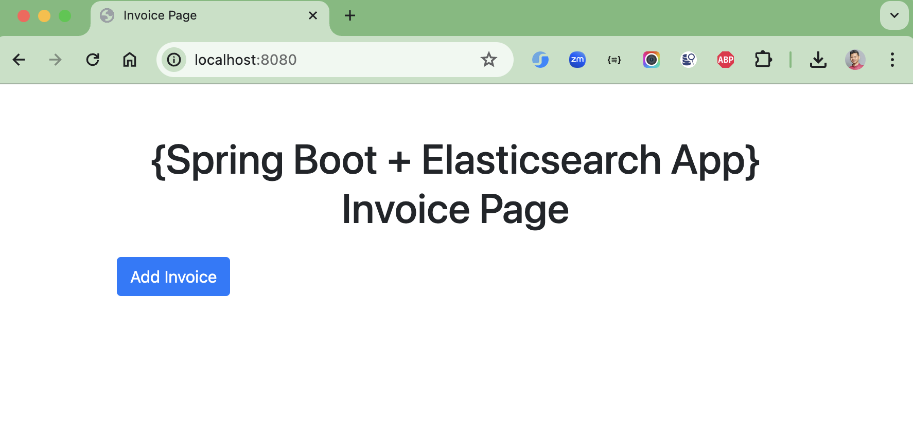
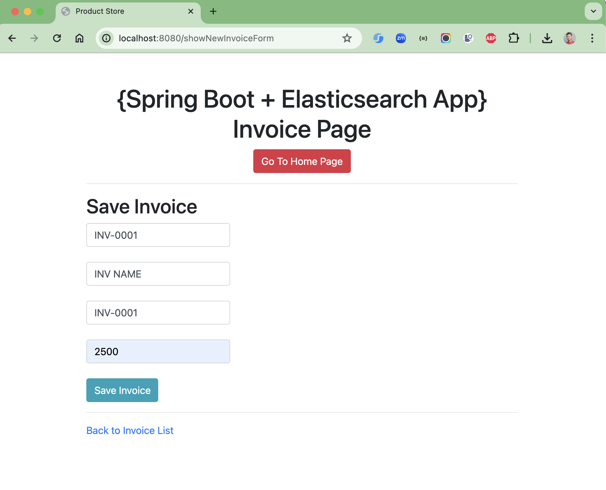
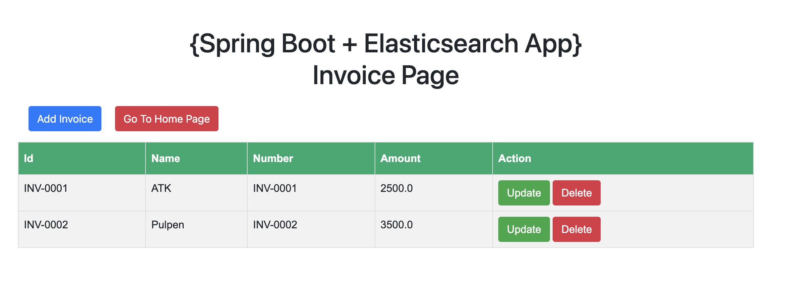
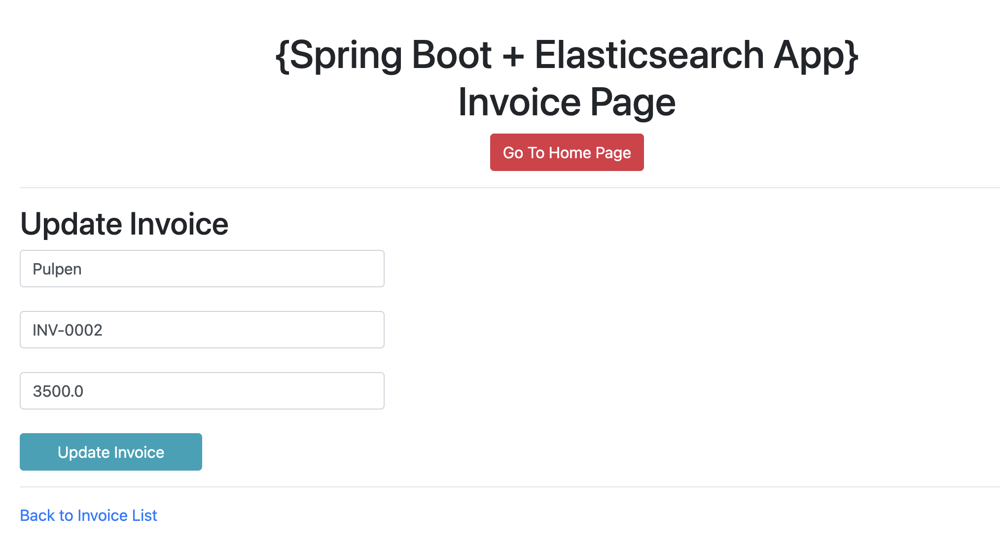

# spring-boot-elasticsearch-thymeleaf

### Things todo list

1. Clone this repository: `git clone https://github.com/hendisantika/spring-boot-elasticsearch-thymeleaf.git`
2. Navigate to the folder: `cd spring-boot-elasticsearch-thymeleaf`
3. Make sure your ELK stack UP & RUNNING
4. Run the application: `mvn clean spring-boot:run`
5. Run Docker Container:
    ```shell
    docker run -p 9200:9200 \
    -e "discovery.type=single-node" \
    -e "xpack.security.enabled=false" \
    docker.elastic.co/elasticsearch/elasticsearch:8.16.1
    ```
6. Open your favorite browser: http://localhost:8080/listInvoice

### Image Screenshot

Home Page



Add New Data



List Invoice



Update Data


